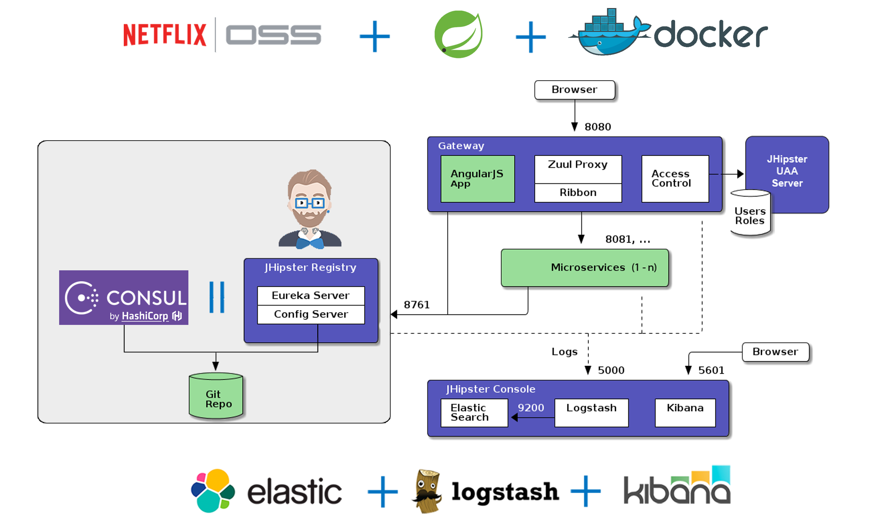

<!-- .slide: class="master01" -->


<!-- section -->
<!-- .slide: class="master02" -->
### JHipster
Adrian Bader<br>
Sombra González


<!-- section -->
<!-- .slide: class="master03" -->
### Was ist JHipster

JHipster ist ein Werkzeug,
um Web-Applikationen mit <br>
Spring Boot und<br>
Angular oder React zu generieren


<!-- section -->
<!-- .slide: class="master04" -->
### Applikationenarten

* Monolithic application
* Microservice 
    * Microservice application: Services
    * Microservice gateway: Edge server
    * Hipster UAA server: OAuth2 authentication server

<!-- section -->
<!-- .slide: class="master04" -->
### Microservices mit JHipster



<!-- slide -->
<!-- .slide: class="master03" -->
### Client-side Technologien

* Angular / React
* Bootstrap
* HTML5 Boilerplate
* Internationalization support
* Sass für CSS design
* NPM
* Webpack
* Testing : Jest & Protractor


<!-- slide -->
<!-- .slide: class="master05" -->
### Server-side Technologien

* Spring Boot
* Spring Security
* Spring MVC REST + Jackson
* Optional Spring Websocket
* Spring Data JPA + Bean Validation
* Maven or Gradle
* Kafka

<!-- slide -->
<!-- .slide: class="master05" -->
### Server-side Technologien - DB

* Liquibase
* Elasticsearch
* NoSQL : MongoDB / Couchbase / Cassandra


<!-- slide -->
<!-- .slide: class="master03" -->
### Installation

* JHipster kann ohne Installation via [JHipster Online](https://start.jhipster.tech) verwendet werden (Account erforderlich)
* Installation mit Package-Manager: NPM, Yarn, Homebrew (Mac OS X), Chocolatey (Windows)

```bash
$ yarn global add yo
$ yarn global add generator-jhipster

```
<!-- slide -->
<!-- .slide: class="master03" -->
### Generators
* Yeoman
* Generators
   * Applikation
   * Entity : Command line + JHipster UML & JDL Studio
   * Spring Controller 
   * Spring Service
   * DTO (Beta)

<!-- slide -->
<!-- .slide: class="master03" -->
### Generators
* JHipster Marketplace
* JHipster Modules :  Yeoman generator basiert auf einen JHipster sub-generator


<!-- slide -->
<!-- .slide: class="master03" -->
### Pros & Cons

