# Einrichten eines Wallets für das "Lightning Network" auf dem Mainnet

Zahlungen mit dem Lightning Network sind blitzschnell. Doch bis man sein
Gerät soweit hat, dass man Zahlungen ausführen kann, dauert es einen Moment.

Diese Anleitung ist für technisch nicht so versierte Benutzer gedacht, die
mit dem Handy bezahlen möchten. Deshalb zeigen wir den Prozess anhand
Apps für Mobilgeräte.

**Diese Anleitung bezieht sich auf Bitcoin Mainnet, also die "produktive"
Bitcoin-Blockchain!** 
Wer eine Anleitung für das Testnet sucht,
[wird hier fündig (Englisch)](https://gugger.guru/lightning-workshop/).

## Schritt 0: Disclaimer

Bevor wir loslegen, möchten wir an dieser Stelle noch einmal ganz klar und deutlich
darauf aufmerksam machen, dass es sich beim Lightning Network um eine Technologie
handelt, die sich noch im Stadium "experimentell" befindet.
Dies bedeutet, dass nicht garantiert werden kann, dass alles fehlerfrei und reibungslos
funktioniert.
Im schlimmsten (jedoch eher unwahrscheinlichen) Fall kann Geld verloren gehen
oder für eine gewisse Zeit nicht zugänglich sein.

**Wir empfehlen deshalb ganz klar, nur mit kleinen Beträgen zu starten!**

## Schritt 1: App installieren

Zum Entstehungszeitpunkt dieses Artikels (Anfang September 2018) gibt es nur
Mainnet-Kompatible Apps für Android-Geräte. Apps für iOS werden hoffentlich sehr
bald erscheinen.

Die hier ersichtlichen Screenshots sind alle vom "Eclair" Wallet. Das Prinzip sollte aber
bei anderen Apps sehr ähnlich sein und die Anleitung sollte deshalb auch für diese
benutzt werden können.

1. Wir installieren uns nun die App "Eclair Wallet Mainnet" aus dem Google Play store: 
  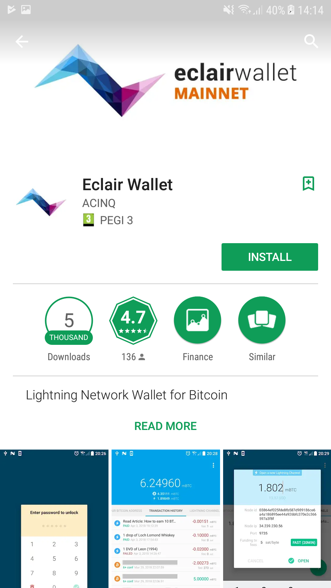
1. Beim Starten wird uns auch hier noch einmal mitgeteilt, dass es sich um "beta"-Software
  handelt: 
  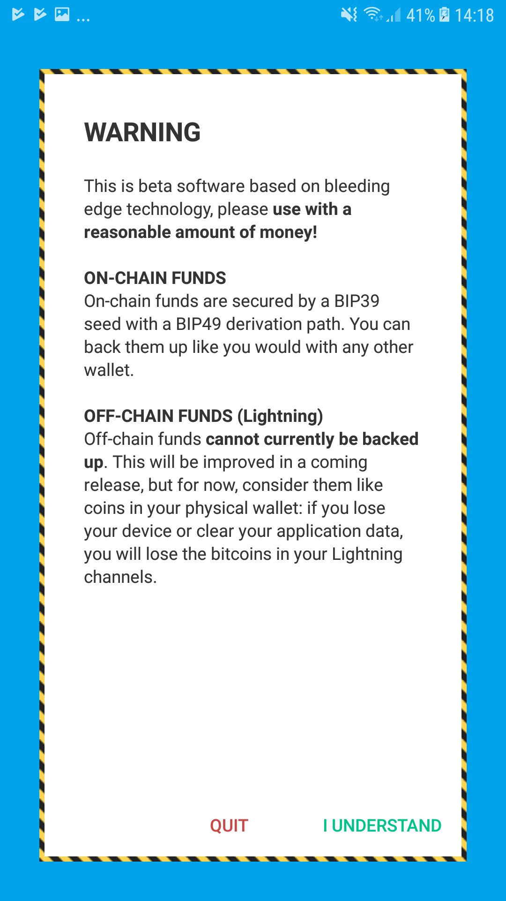
1. Nach der Bestätigung der Warnung, werden wir gefragt, ob wir ein neues Wallet
  einrichten oder ein bestehendes importieren wollen. Wir wollen ein neuer erstellen
  und wählen deshalb "Create New Wallet": 
  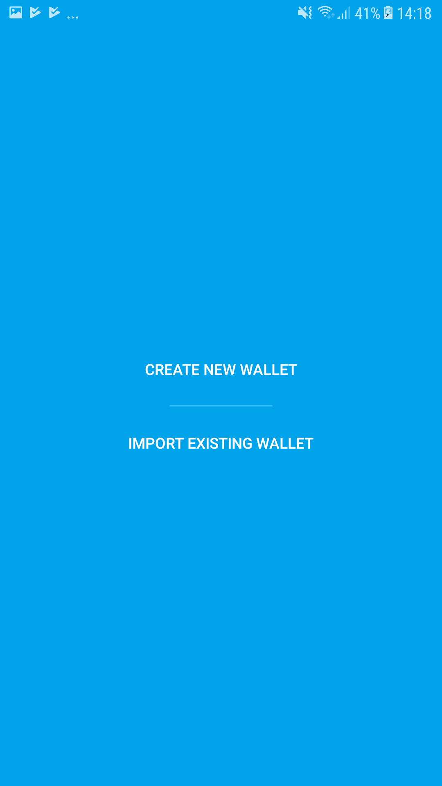
1. Nun kommt ein sehr sehr wichtiger Teil: Die 24 Wörter. 
  Hier gibt es absichtlich keinen Screenshot, weil diese 24 Wörter sehr geheim sind.
  Diese Wörter widerspiegeln den kryptografischen Zugangscode auf das gesamte Guthaben,
  das später in dem Wallet sein wird. Das heisst, wer die Wörter kennt, hat Zugriff
  auf das Geld. 
  Deshalb:
   - **Wörter aufgschreiben und an einem sicheren Ort aufbewahren**: Wenn das Handy
   defekt ist, oder verloren geht, dann kann mit den Wörtern das Guthaben widerhergestellt
   werden. Aber ohne die Wörter, ist alles weg! Es gibt keine Bank die "das Konto entsperren"
   kann. Daher, am besten in den Safe mit dem Zettel.
   - **Niemals jemandem diese Wörter anvertrauen**: Eine Person oder Webseite, die nach
   diesen Wörtern fragt, versucht sehr wahrscheinlich, das Guthaben zu stehlen. Darum sollte
   ein Backup nur bei Apps eingespielt werden, bei denen man sicher ist, dass sie
   vertrauenswürdig sind.
1. Hat man die Wörter aufgeschrieben, werden sie gleich überprüft. Die App fragt nach 3
  zufälligen Wörtern aus der Liste, die man soeben aufgeschrieben hat. Hat man diese bestätigt,
  wird noch nach einem PIN gefragt. Dieser schützt lediglich die App vor Fremdzugriffen,
  falls das Handy gestolen wird. Dieser PIN kann, im Gegensatz zu den 24 Wörtern, jederzeit
  geändert werden. Nach dem Erstellen des PINs gelangt man auf den Hauptbildschirm der App.

Die App ist nun erfolgreich installiert und die Geldbörse/das Wallet eingerichtet.
Wir können nun auf den drei Hauptbildschirmen der App herumnavigieren, in dem wir nach
links oder rechts swipen/streichen:

<table border="0" cellpadding="5">
<tr>
<td>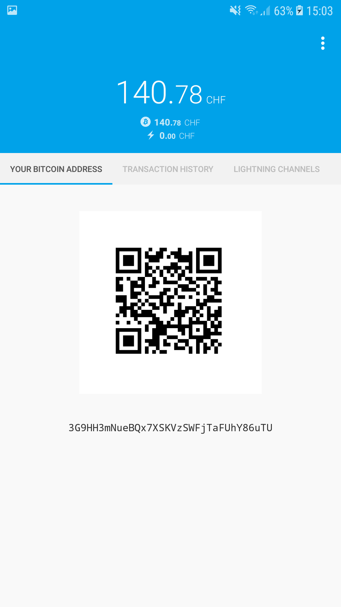</td>
<td>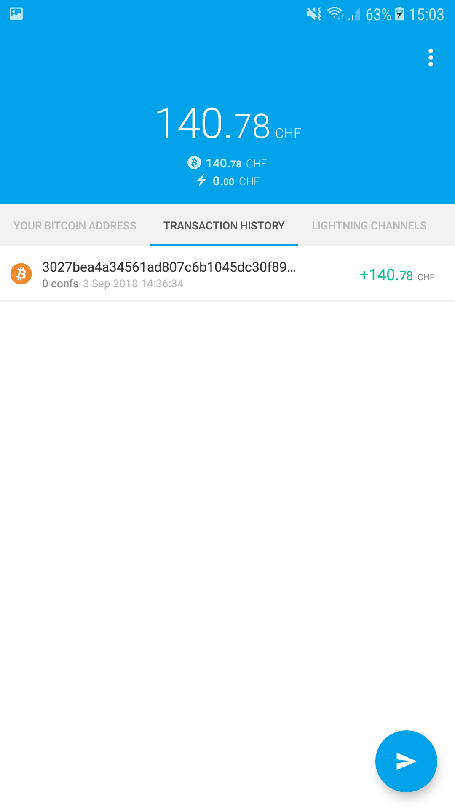</td>
<td>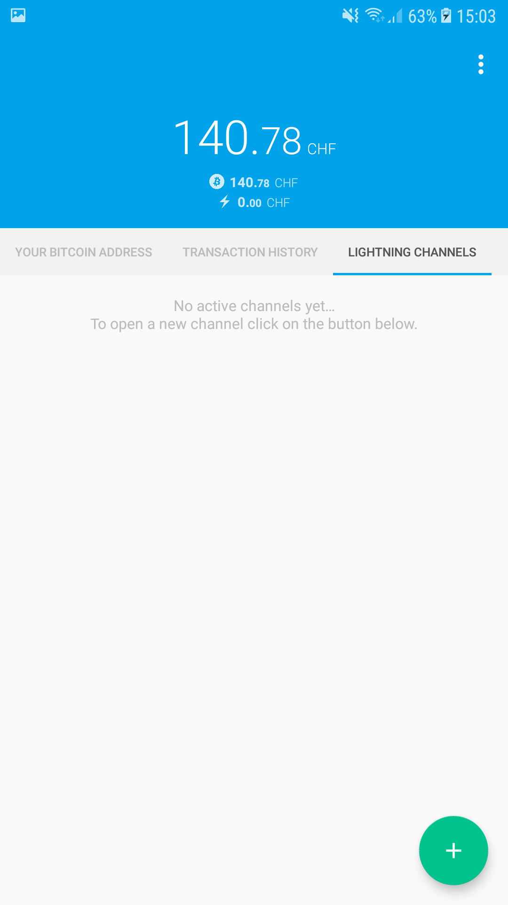</td>
</tr>
<tr>
<td>Links: Bitcoin-Adresse</td>
<td>Mitte: Transaktionen</td>
<td>Rechts: Lightning Channels</td>
</tr>
</table>

## Schritt 2: Bitcoin einkaufen

Jetzt sind wir bereit, um das Wallet mit Bitcoin zu bestücken. Hier gibt es natürlich diverse
Möglichkeiten. Wir zeigen hier eine einfache und unkomplizierte Möglichkeit, die an jedem
Bahnhof der Schweiz funktioniert: Bitcoin am SBB-Ticket-Automaten kaufen.

Alles, was wir dazu benötigen, ist eine Schweizer Handy-Nummer, die SMS empfangen kann. Denn am
SBB-Automaten kann man pro Handy-Nummer pro Tag maximal CHF 500.- in Bitcoin beziehen.
Geprüft wird dies durch einen mTAN, der per SMS aufs Handy gesendet wird.

Stehen wir vor dem Automaten, wählen wir unter "Prepaid" den Punkt "Bitcoin aufladen".
Jetzt müssen wir als erstes unsere Bitcoin-Adresse in den Automat einscannen. Dafür
öffnen wir die Eclair-App und wischen nach rechts, um auf das Tab "Your Bitcoin Address" zu
gelangen.

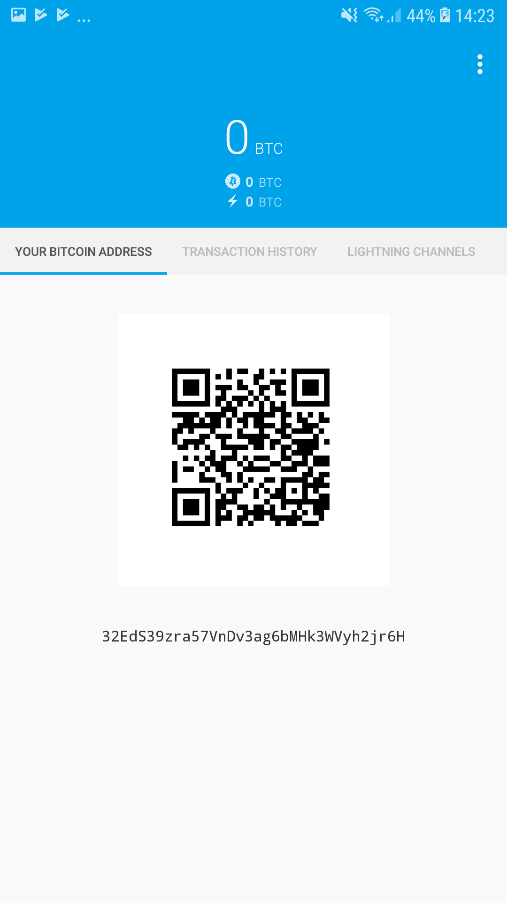

Der QR-Code, der dort angezeigt wird, muss nun beim Automaten vor die Kamera gehalten
werden. Dies kann, je nach Lichtverhältnissen etwas schwierig sein. 
Es scheint, als wäre ein Abstand von ca. 20cm von der Kamera optimal.
Falls es einen Moment lang nicht klappt, kann es sein, dass der Automat zurück zum Hauptbildchirm
wechselt. In diesem Fall muss einfach wieder "Prepaid" und dann "Bitcoin aufladen" gewählt werden.

Konnte die Adresse eingelesen werden, wird sie am Automat angezeigt. Aus Sicherheitsgründen
kontrollieren wir kurz, ob es die korrekte Adresse ist (es empfiehlt sich, die ersten und letzten 4
Zeichen einer Bitcoin-Adresse immer kurz zu prüfen!).

Nun fragt der Automat nach einer Handy-Nummer und sendet nach Eingabe dieser ein SMS dahin.
Den 4-stelligen Code vom SMS muss man nun auch im Automat eingeben.

Ist alles korrekt, wird nun eine Zusammenfassung angezeigt, welche auch den Bitcoin-Kurs und die
Gebühren beinhaltet. Ist man damit einverstanden, kann man den gewählten Betrag bezahlen (mit Karte
oder bar). Natürlich erhält man nach dem Bezahlen auch eine detaillierte Papier-Quittung.

In der App sollte es unter "Transaction History" nun etwa so aussehen:

Die Überweisung wurde also registriert, aber sie ist noch nicht bestätigt ("0 confs").
Sobald mindestens 3 Confirmations erreicht sind, gilt die Überweisung als getätigt und der
Betrag kann in der App verwendet werden.

[Weitere Informationen zum Kauf von Bitcoin am SBB-Automaten](https://www.sbb.ch/de/bahnhof-services/dienstleistungen/weitere-dienstleistungen/bitcoin.html)

## Schritt 3: Channel zu Puzzle-Node eröffnen

Wenn wir 3 Bestätigungen auf der eingehenden Transaktion haben, dann können wir jetzt zum letzten
Schritt übergehen: Wir eröffnen einen "Lightning Network"-Channel. 
Dies kann man sich vorstellen, als ob man eine Prepaid-Karte auflädt. Das Aufladen kann einen
Moment dauern, aber sobald das Guthaben auf der Karte ist, kann man es sehr einfach und rasch
ausgeben.

Auch der letzte Schritt dauert einen Moment, denn auch hier wird wieder eine Transaktion in die
Bitcoin-Blockchain geschrieben und braucht wieder 3 Confirmations. Dies ist aber das letzte Mal,
das wir warten müssen. Ist der Channel erst einmal offen, geht alles blitzschnell.

1. Wir gehen mit einem Wisch nach rechts auf das Tab "Lightning Channels" und klicken auf den
  Button unten. 
  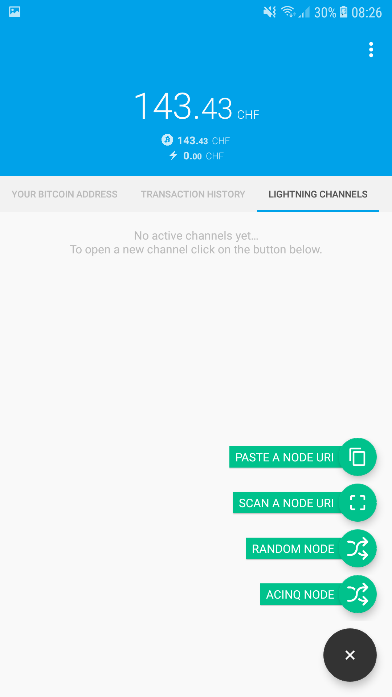 
  Haben wir einen PC oder anderes Gerät in der Nähe, dann ist es am einfachsten,
  wenn wir dort die Webseite [lightning.puzzle.ch](https://lightning.puzzle.ch) aufrufen und
  dann vom Handy aus den QR-Code einscannen. Dazu wählen wir in der Eclair-App den Button
  "Scan A Node URI". 
  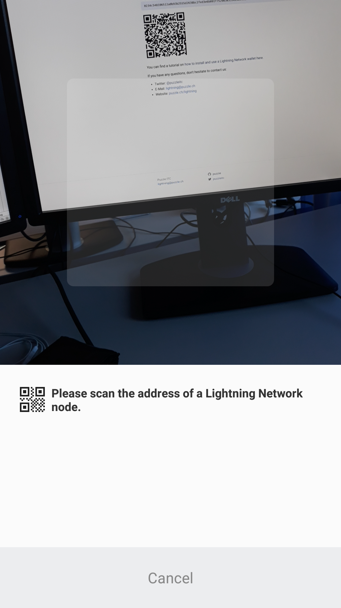 
  Haben wir nur das Handy zur Verfügung, dann öffnen wir die Webseite
  [lightning.puzzle.ch](https://lightning.puzzle.ch) im Internetbrowser des Handys und kopieren
  den Text oberhalb des QR-Codes. Wichtig hier ist, dass der gesamte Text erwischt wird, also
  bis und mit <code>...@lightning.puzzle.ch:9735</code>.
  In der Eclair-App wählen wir nun "Paste A Node URI" und fügen den kopierten Text dort ein.
1. Nun sollte der Bildschirm so oder ähnlich aussehen: 
  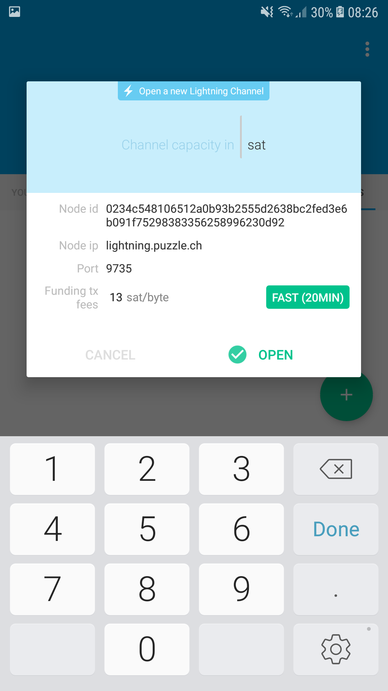
1. Jetzt müssen wir den Betrag in Bitcoin eingeben, den wir in den Channel stecken möchten.
  Dieser Betrag kann höchstens 0.16 BTC pro Channel sein.
  Je nach Kurs haben wir aber deutlich weniger gekauft, deshalb möchten wir unter Umständen
  alle gekauften Bitcoins in den Channel stecken. Dies ist möglich, man muss aber vom gekauften
  Betrag noch ca 0.00001 Bitcoin abziehen für die Channel-Eröffnungsgebühr.
1. Wird der Betrag akzeptiert, dann sollte nun der Channel in Eröffnung sein: 
  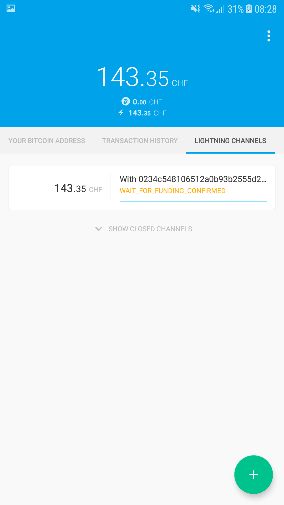 
  War der gewählte Betrag zu gross, dann wird eine Fehlermeldung angezeigt werden und der Channel
  verschwindet unter Umständen wieder. Dann muss man den Betrag für die Channel-Kapazität beim nächsten
  Versuch kleiner wählen. 
  Dieser Schritt erscheint unnötig kompliziert und das ist er auch. Hier wird sicherlich noch vieles
  optimiert werden an der Bedienerfreundlichkeit.
1. Nach 3 Confirmations sollte der Channel dann ready sein:  
  
1. Ab sofort können nun "Lightning Network"-Zahlungen ausgeführt werden! 
  Dazu wählt man im Tab "Transaction History" den Button unten rechts und dann im Menü
  den Punkt "Scan A Payment Request", wonach man dann den QR-Code, den man bezahlen möchte, scannen
  kann: 
  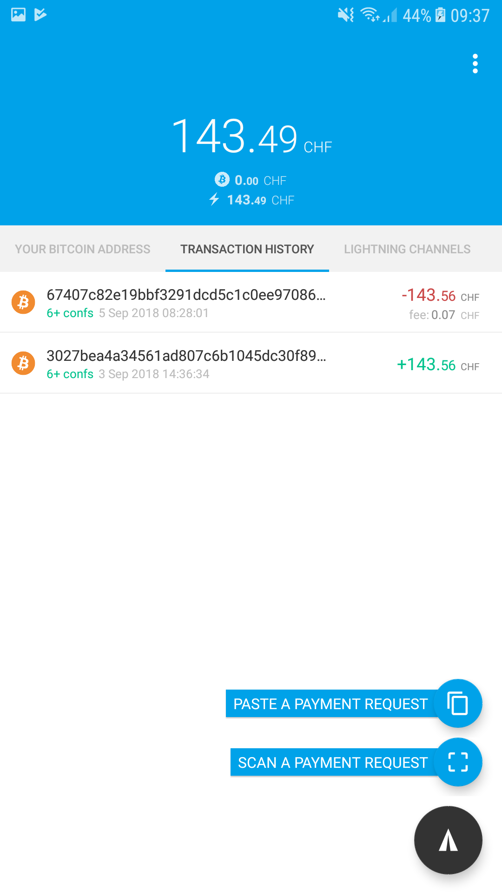

* Darauf hinweisen, warum Puzzle-Node, Vor-/Nachteile zeigen
* Vergleich mit Prepaid-Guthaben aufstellen, aber mit Unterschied, dass
  über den Channel auch Geld zurückfliessen kann
* Dauert 3 Confirmations

# FAQ

(work in progress...)

* Geld zurück verlangen?
  * Payment Request erzeugen

* Was ist, wenn Geld im Channel aufgebraucht?
  * Channel schliessen oder Geld zurück erhalten
 
* Channel funktioniert nicht?
  * App neu starten