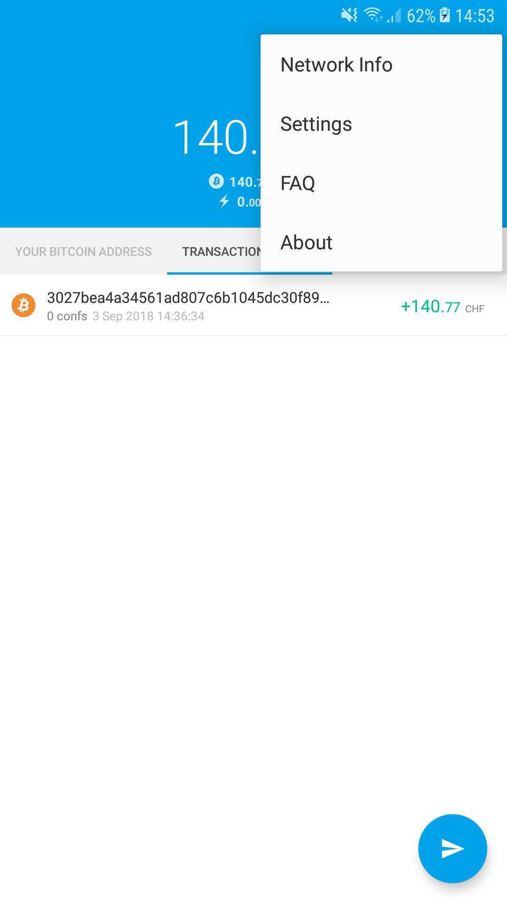
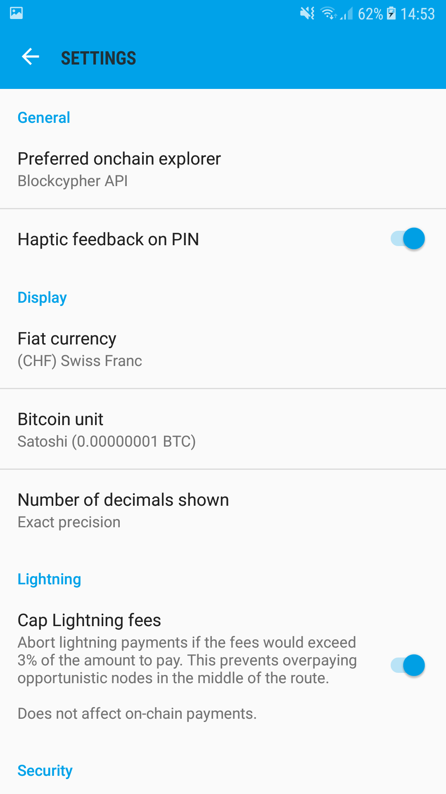
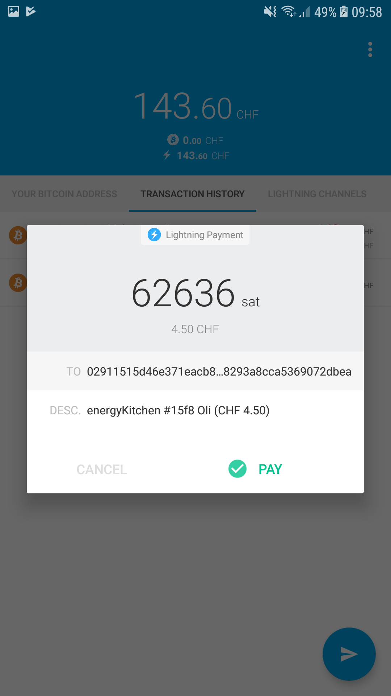

# Wallet einrichten für das "Lightning Network" auf dem Mainnet

Zahlungen mit dem Lightning Network gehen blitzschnell. Bis jedoch das
Gerät soweit hat, dass Zahlungen ausgeführt werden, dauert es einen Moment.

Diese Anleitung ist für technisch weniger versierte Benutzer, welche
mit dem Handy bezahlen möchten. Deshalb zeigen wir den Prozess anhand
Apps für Mobilgeräte.

**Diese Anleitung bezieht sich auf Bitcoin Mainnet, also die "produktive"
Bitcoin-Blockchain!** 
Wer eine Anleitung für das Testnet sucht,
[wird hier fündig (Englisch)](https://gugger.guru/lightning-workshop/).

## Schritt 0: Disclaimer

Bevor wir loslegen, möchten wir an dieser Stelle noch einmal klar
darauf aufmerksam machen, dass es sich beim Lightning Network um eine Technologie
handelt, die sich noch im Stadium "experimentell" befindet.
Dies bedeutet, dass momentan keine Garantie besteht, dass alles fehlerfrei und reibungslos
funktioniert.
Im schlimmsten (jedoch eher unwahrscheinlichen) Fall kann Geld verloren gehen
oder für eine gewisse Zeit nicht zugänglich sein.

**Wir empfehlen deshalb, nur mit kleinen Beträgen zu starten!**

## Schritt 1: App installieren

Zum Entstehungszeitpunkt dieses Artikels (Anfang September 2018) gibt es nur
Mainnet-kompatible Apps für Android-Geräte. Apps für iOS werden hoffentlich
bald erscheinen.

Die ersichtlichen Screenshots sind alle vom "Eclair" Wallet. Das Prinzip sollte aber
bei anderen Apps ähnlich sein und deshalb kann diese Anleitung verwendet werden.

1. Wir installieren nun die App "Eclair Wallet Mainnet" aus dem Google Play Store: 
  
1. Beim Starten wird uns noch einmal mitgeteilt, dass es sich um "beta"-Software
  handelt: 
  
1. Nach der Bestätigung der Warnung, werden wir gefragt, ob wir ein neues Wallet
  einrichten oder ein bestehendes importieren wollen. Wir wollen ein neues erstellen
  und wählen deshalb "Create New Wallet": 
  
1. Nun kommt ein sehr sehr wichtiger Teil: Die 24 Wörter. 
  Hier gibt es absichtlich keinen Screenshot, weil diese 24 Wörter sehr geheim sind.
  Diese Wörter widerspiegeln den kryptografischen Zugangscode auf das gesamte Guthaben,
  das später in dem Wallet sein wird. Das heisst, wer die Wörter kennt, hat Zugriff
  auf das Geld. 
  Deshalb:
   - **Wörter aufgschreiben und an einem sicheren Ort aufbewahren**: Wenn das Handy
   defekt ist, oder verloren geht, dann kann mit den Wörtern das Guthaben widerhergestellt
   werden. Ohne die Wörter, ist alles weg! Es gibt keine Bank die "das Konto entsperren"
   kann. Daher am besten in den Safe mit dem Zettel.
   - **Niemals jemandem diese Wörter anvertrauen**: Eine Person oder Webseite, die nach
   diesen Wörtern fragt, versucht sehr wahrscheinlich, das Guthaben zu stehlen. Darum sollte
   ein Backup nur bei Apps eingespielt werden, bei denen man sicher ist, dass sie
   vertrauenswürdig sind.
1. Hat man die Wörter aufgeschrieben, werden sie gleich überprüft. Die App fragt nach 3
  zufälligen Wörtern aus der Liste, die man aufgeschrieben hat. Achtung, diese müssen mit einem
  Leerzeichen getrennt eingegeben werden! Hat man diese bestätigt,
  wird nach einem PIN gefragt. Dieser schützt lediglich die App vor Fremdzugriffen,
  falls das Handy gestohlen wird. Dieser PIN kann, im Gegensatz zu den 24 Wörtern jederzeit
  geändert werden. Nach dem Erstellen des PINs gelangt man auf den Hauptbildschirm der App.

Die App ist nun erfolgreich installiert und die Geldbörse/das Wallet eingerichtet.
Wir können nun auf den drei Hauptbildschirmen der App herumnavigieren, in dem wir nach
links oder rechts swipen/streichen:

<table border="0" cellpadding="5">
<tr>
<td></td>
<td></td>
<td></td>
</tr>
<tr>
<td>Links: Bitcoin-Adresse</td>
<td>Mitte: Transaktionen</td>
<td>Rechts: Lightning Channels</td>
</tr>
</table>

Es empfiehlt sich, jetzt noch kurz die Einheiten anzupassen, die uns die App anzeigt.
Die Folgenden Screenshots sind (grösstenteils) in CHF für die Fiat-Währungen und in
Satoshi (= 0.00000001 Bitcoin/BTC) für die Bitcoin-Einheit abgebildet. 
Das Einstellungs-Menü findet man hier: 

## Schritt 2: Bitcoin einkaufen

Jetzt sind wir soweit, um das Wallet mit Bitcoin zu bestücken. Hier gibt es diverse
Möglichkeiten. Wir zeigen hier eine einfache und unkomplizierte Variante, die an jedem
Bahnhof der Schweiz funktioniert: Bitcoin am SBB-Ticket-Automaten kaufen.

Alles, was wir dazu benötigen, ist eine Schweizer Handynummer, die SMS empfangen kann. Denn am
SBB-Automaten kann man pro Handy-Nummer pro Tag maximal CHF 500.- in Bitcoin beziehen.
Geprüft wird dies durch einen mTAN, der per SMS aufs Handy gesendet wird.

Stehen wir vor dem Automaten, wählen wir unter "Prepaid" den Punkt "Bitcoin aufladen".
Jetzt müssen wir als erstes unsere Bitcoin-Adresse in den Automat einscannen. Dafür
öffnen wir die Eclair-App und wischen nach rechts, um auf das Tab "Your Bitcoin Address" zu
gelangen.

Der QR-Code, der dort angezeigt wird, muss nun beim Automaten vor die Kamera gehalten
werden. Dies kann je nach Lichtverhältnissen etwas schwierig sein. 
Ein Abstand von ca. 20cm von der Kamera ist dafür optimal.
Falls es einen Moment lang nicht klappt, kann es sein, dass der Automat zurück zum Hauptbildschirm
wechselt. In diesem Fall muss einfach wieder "Prepaid" und dann "Bitcoin aufladen" gewählt werden.

Konnte die Adresse eingelesen werden, wird sie am Automat angezeigt. Aus Sicherheitsgründen
kontrollieren wir kurz, ob es die korrekte Adresse ist (es empfiehlt sich, die ersten und letzten vier
Zeichen einer Bitcoin-Adresse immer zu prüfen!).

Jetzt wählen wir den Betrag aus, den wir in Bitcoin umwandeln wollen.

Weiter fragt nun der Automat nach einer Handynummer und sendet nach Eingabe dieser ein SMS dahin.
Den im SMS enthaltenen 4-stelligen Code muss danach im Automat eingegeben werden.

Ist alles korrekt, wird nun eine Zusammenfassung angezeigt, welche auch den Bitcoin-Kurs und die
Gebühren beinhaltet. Ist man damit einverstanden, kann man den gewählten Betrag bezahlen (mit Karte
oder bar). Nach dem Bezahlen gibt es eine detaillierte Papier-Quittung.

In der App sollte dies unter "Transaction History" etwa so aussehen:

Die Überweisung wurde registriert, ist aber noch nicht bestätigt ("0 confs").
Sobald mindestens 3 Confirmations erreicht sind, gilt die Überweisung als getätigt und der
Betrag kann in der App verwendet werden.

[Weitere Informationen zum Kauf von Bitcoin am SBB-Automaten](https://www.sbb.ch/de/bahnhof-services/dienstleistungen/weitere-dienstleistungen/bitcoin.html)

## Schritt 3: Channel zu Puzzle-Node eröffnen

Wenn wir drei Bestätigungen auf der eingehenden Transaktion haben, können wir zum letzten
Schritt übergehen: Wir eröffnen einen "Lightning Network"-Channel. 
Dies ist etwa so, als ob man eine Prepaid-Karte auflädt. Das Aufladen kann einen
Moment dauern, aber sobald das Guthaben auf der Karte ist, kann man es sehr einfach und rasch
ausgeben.

Der letzte Schritt dauert einen Moment, denn auch hier wird wieder eine Transaktion in die
Bitcoin-Blockchain geschrieben und braucht wieder drei Confirmations. Dies ist aber der letzte Schritt,
bei dem wir warten müssen. Ist der Channel erst einmal offen, geht alles blitzschnell.

1. Wir gehen mit einem Wisch nach rechts auf das Tab "Lightning Channels" und klicken auf den
  Button unten. 
   
  Haben wir einen PC oder anderes Gerät in der Nähe, dann ist es am einfachsten,
  wenn wir dort die Webseite [lightning.puzzle.ch](https://lightning.puzzle.ch) aufrufen und
  dann vom Handy aus den QR-Code einscannen. Dazu wählen wir in der Eclair-App den Button
  "Scan A Node URI". 
   
  Haben wir nur das Handy zur Verfügung, dann öffnen wir die Webseite
  [lightning.puzzle.ch](https://lightning.puzzle.ch) im Internetbrowser des Handys und kopieren
  den Text oberhalb des QR-Codes. Wichtig ist hier, dass der gesamte Text kopiert wird, also
  bis und mit <code>...@lightning.puzzle.ch:9735</code>.
  In der Eclair-App wählen wir nun "Paste A Node URI" und fügen den kopierten Text dort ein.
1. Nun sollte der Bildschirm so oder ähnlich aussehen: 
  
1. Jetzt müssen wir den Betrag in Bitcoin eingeben, den wir in den Channel stecken möchten.
  Dieser Betrag kann höchstens 16'667'000 Satoshi (=0.16 BTC) pro Channel sein.
  Je nach Kurs haben wir aber deutlich weniger gekauft, deshalb möchten wir unter Umständen
  alle gekauften Bitcoins in den Channel stecken. Dies ist möglich, man muss aber vom gekauften
  Betrag noch ca 1000 Satoshi (≃0.00001 BTC) abziehen für die Channel-Eröffnungsgebühr. 
  Haben wir also beispielsweise 5'000'000 Satoshi zur Verfügung (gemäss Kontostand im Wallet),
  dann geben wir bei der "Channel capacity" die Zahl 4'999'000 ein.
1. Wird der Betrag akzeptiert, dann sollte nun der Channel eröffnet werden: 
   
  War der gewählte Betrag zu gross, dann wird eine Fehlermeldung angezeigt und der Channel
  verschwindet unter Umständen wieder. Dann muss man den Betrag für die Channel-Kapazität beim nächsten
  Versuch reduzieren. 
  Dieser Schritt erscheint unnötig kompliziert und das ist er auch. Hier und allgemein bei der
  Bedienerfreundlichkeit wird sicherlich noch vieles durch die App-Hersteller optimiert.
1. Nach drei Confirmations sollte der Channel dann ready sein:  
  
1. Ab sofort können nun "Lightning Network"-Zahlungen ausgeführt werden! 
  Dazu wählt man im Tab "Transaction History" den Button unten rechts und dann im Menü
  den Punkt "Scan A Payment Request", wonach man dann den QR-Code, den man bezahlen möchte, scannen
  kann: 
   
  Die App zeigt dann die Rechnung nochmals kurz an und kann dan bezahlt werden: 
  

Hat die Zahlung geklappt? Ja? **Dann herzlichen Glückwunsch und willkommen in der Zukunft
des Bezahlens!**

# FAQ

* Warum eröffnen wir einen Channel mit der Puzzle-Node?
  * Der Vorteil am Lightning Network (und an Bitcoin generell) ist, dass jeder einfach mitmachen
    und auch seine eigene Node aufbauen kann. Weshalb soll ich mich dann zu Puzzle verbinden und
    nicht zu irgend einer anderen Node? 
    Natürlich ist das jeder Person selbst überlassen. Wir von Puzzle ITC versprechen aber, dass
    wir die Gebühren unserer Channels tief halten und uns um eine gute Liquidität kümmern werden.
    Das heisst, wir wollen gut befüllte Channels zu allen Schweizer Verkäufern aufbauen, damit
    alle Benutzer unserer Node sehr gute und kurze Routen zu allen Geschäften haben, die am
    Lightning Network mitmachen.

* Kann ich auch Geld empfangen über das Lightning Network?
  * Im Protokoll ist das natürlich grundsätzlich möglich. Die Eclair-App unterstützt dies aber aus
    technischen und sicherheitsrelevanten Gründen noch nicht. Dies wird sich aber hoffentlich
    bald ändern. 
    [Mehr dazu in den FAQ von Eclair (Englisch)](https://github.com/ACINQ/eclair-wallet/wiki/FAQ). 

* Was passiert, wenn ich das Guthaben meines Channels aufgebraucht habe?
  * Ist das Guthaben eines Channels aufgebraucht, dann kann darüber nicht mehr bezahlt werden.
    Es muss also ein neuer Channel eröffnet werden. Zukünftig, wenn man mit Eclair auch Geld
    empfangen kann, dann ist es möglich, dass man im bereits eröffneten Channel wieder Guthaben zurück
    erhält, das wieder ausgeben kann. Beispielsweise, indem man
    [einen Teil seines Lohns](https://www.inside-it.ch/articles/50118) über Lightning ausbezahlt kriegt,
    oder bei einer Finanzinstitution CHF direkt gegen Lightning-Guthaben tauscht. 
    Somit müsste ein Channel theoretisch nie geschlossen werden.
 
 
* Was mache ich, wenn mein Channel immer "OFFLINE" oder sonst in einem fehlerhaften Zustand stecken bleibt?
  * Die Eclair-App hat noch einige Kinderkrankheiten, die hoffentlich mit Updates bald behoben werden. 
    Oft hilft es aber, die App komplett zu beenden (über das Android-Menü) und neu zu starten. 
    Manchmal hilft es auch, wenn man versucht einen neuen Channel zu eröffnen, dann werden die bestehenden
    Channels auch noch einmal neu geprüft. 
    Evtl. helfen auch [die FAQ von Eclair (Englisch)](https://github.com/ACINQ/eclair-wallet/wiki/FAQ) weiter.

* Wann gibt es eine App für iOS?
  * Es gibt bereits eine [beachtliche Liste](http://lightningnetworkstores.com/wallets) an Wallets,
    die auf dem Testnet für iOS verfügbar sind. Wann das erste davon für Mainnet herausgegeben wird,
    ist schwierig zu sagen. Bis Ende 2018 sollte aber spätestens auch für iOS ein Wallet erhältlich sein,
    das keine eigene "Full-Node" benötigt. 
    Traut man sich technisch etwas zu, kann man natürlich auf einem Server eine Lightning-Node aufsetzen
    und dann von seinem iOS-Gerät aus diese fernsteuern. Anleitungen gibt es z.B.
    [hier](https://www.lndthinwallet.com/) und
    [hier](https://gist.github.com/bretton/0b22a0503a9eba09df86a23f3d625c13).