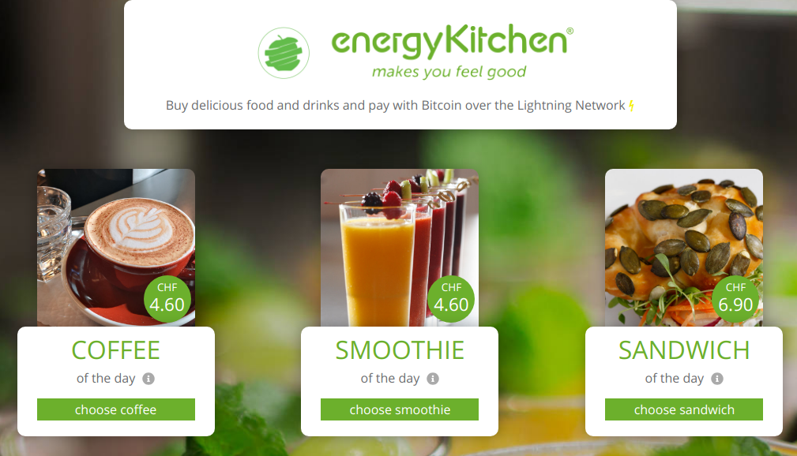

<!-- .slide: class="master01" -->

<!-- section -->
### Workshop: Lightning Network (Mainnet)
Oliver Gugger

[@gugol](https://twitter.com/gugol) 
[github.com/guggero](https://github.com/guggero) 
slides: [puzzle.github.io](https://puzzle.github.io)

Part of the Lightning Network team at 
Puzzle ITC, contributor to LND
<!-- .slide: class="master02" -->

<!-- slide -->
### Agenda
* Host and guests
* Why are we here?
* What is the Lightning Network?
* Live demo
* Hands-on part 1: install app(s)
* Hands-on part 2: buy bitcoins
* Hands-on part 3: open channels
* Try yourself
<!-- .slide: class="master02" -->

<!-- slide -->
### Hosts and guests
* Event hosts
   * Petra & Christian Gierstorfer  (Energy Kitchen), Thank you!
* Guests
   * Salzgeber Kilian (SBB)
   * Schweizer Catherine Grace (SBB)
   * Lafranchi Gabriele (SweePay)
<!-- .slide: class="master03" -->

<!-- slide -->
### Why are we here?
<ul>
<li class="fragment fade-in">Lightning Network Workshop in May</li>
<li class="fragment fade-in">Kick-off in June</li>
<li class="fragment fade-in">Go-live in September</li>
</ul>

  
  

<!-- .slide: class="master04" -->

<!-- section -->
### What is the Lightning Network?
<ul>
<li class="fragment fade-in">Scaling solution for Bitcoin</li>
<li class="fragment fade-in">Layer 2 implemented with Smart Contracts</li>
<li class="fragment fade-in">Trustless micropayments in milliseconds</li>
<li class="fragment fade-in">
  Or: Savings (Ƀ) vs. Checking (&#x26A1;) account
</li>
</ul>
<!-- .slide: class="master05" -->

<!-- slide -->
### What is the Lightning Network (2)?
* Scalability: billions of users
* Speed: 500 tx/s per channel
* Reliability: synchronous real-time payments
* Privacy: individual payments are private
* Cost: fees are very low
* Innovation: don't compromise base layer
<!-- .slide: class="master05" -->

<!-- slide -->
### What is the Lightning Network (3)?
Visualization: [puzzle.github.io](https://puzzle.github.io)
<!-- .slide: class="master05" -->

<!-- section -->
### Hands-on
* Tutorial: [puzzle.github.io](https://puzzle.github.io)
  * Install Eclair
  * Buy bitcoins (SBB ticket machine)
  * Open channel ([lightning.puzzle.ch](https://lightning.puzzle.ch))
* Testnet / iOS:
  * Install any app from [lightningnetworkstores.com/wallets](http://lightningnetworkstores.com/wallets)
  * Ask Oli for Testnet Bitcoin
  * Open channel ([lightning-test.puzzle.ch](https://lightning-test.puzzle.ch))
<!-- .slide: class="master01" -->